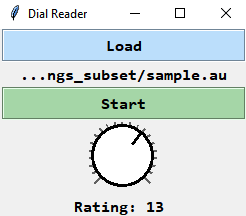

# Continuous Annotation of Dialog Quality

## Requirements
- [Midlevel Prosodic Features Toolkit](https://github.com/nigelgward/midlevel) 7.1
- [VOICEBOX](http://www.ee.ic.ac.uk/hp/staff/dmb/voicebox/voicebox.html) July 2, 2019
- [MATLAB](https://www.mathworks.com/products/matlab.html) R2019b with [Curve Fitting Toolbox](https://www.mathworks.com/products/curvefitting.html) 3.5.10 and [Signal Processing Toolbox](https://www.mathworks.com/products/signal.html) 8.3
- [SoX](http://sox.sourceforge.net/Main/HomePage) 14.4.1
- [Python](https://www.python.org/) 3.7 with [pySerial](https://pythonhosted.org/pyserial/) 3.4
- [Cygwin](https://www.cygwin.com/) or [Ubuntu on Windows](https://www.microsoft.com/en-us/p/ubuntu/9nblggh4msv6) or any other Linux distribution compatible with Windows Subsystem for Linux

This project has been fully tested and is supported on Windows 10.

## Usage

### Convert Dialogs from WAV to AU
Download the LEGOv2 database and unzip. Run the `convertDialogs` script from the `LEGOv2` directory to convert all dialogs from WAV to AU. The resulting files will be stored in a new `recordings` directory.
```
./convertDialogs
```
**Note**: The path to the SoX executable must be added to your PATH environment variable. If you are using SoX 14.4.2, you will get a *"no default audio device configured"* error. This issue is specific to Windows 10 and can be resolved by downgrading to version 14.4.1.

### Extract Prosodic Features
From MATLAB, call the `extractFeatures` function with the path to `recordings` as its argument to extract prosodic features for all dialogs using the Midlevel Prosodic Features Toolkit. The resulting monster matrices will be stored in a new `monsters` directory.
```
extractFeatures(<path>)
```
**Note**: If you are using MATLAB R2019a or above, update line 42 of `findDimensions.m` to use `pca` instead of `princomp` (the `princomp` function was removed as of R2019a).

### Build the Hardware
*This section will be updated soon.*

### Collect Annotations
The Dial Reader application presents a simple graphical user interface for playing an audio file while simultaneously recording your dial's value. 
```
usage: dial_reader.py [-h] device_name

positional arguments:
  device_name  device name associated with dial, e.g. 'COM3'

optional arguments:
  -h, --help   show this help message and exit

```
Once open, click `Load` and select an AU file. Click `Start` to start recording. You can stop recording by clicking `Stop` or by waiting for the playback to end. When the recording stops, enter a name for the annotation file and click `Save`.

<p align="center">
  
</p>

Annotation files are tab-separated text files with the following values: *tier*, *duration*, *start time*, *end time*, *rating*.
```
rating	00:00:03.571	00:00:01.987	00:00:05.558	12
```

**Note**: The path to the Python executable must be added to your PATH environment variable. You can find the port associated with your dial by looking at the devices listed under `Ports` in Windows' Device Manager.

## Resources
- [The Integral LET'S GO! Dataset](https://github.com/DialRC/LetsGoDataset)
- [Updated Parameterized & Annotated CMU Let’s Go Database (LEGOv2)](https://www.ultes.eu/ressources/lego-spoken-dialogue-corpus/)