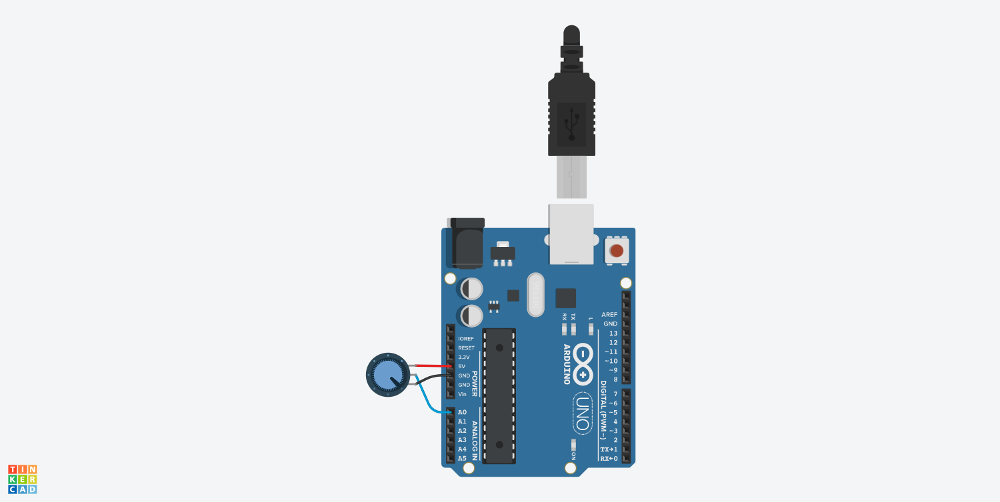
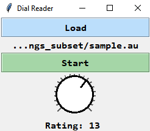
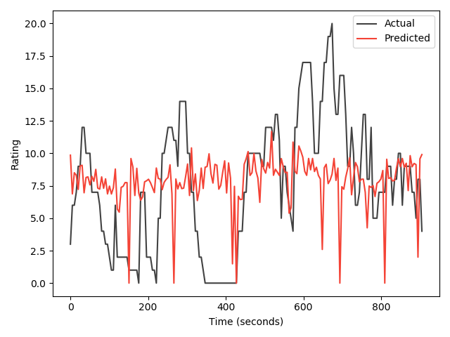

# Continuous Annotation of Dialog Quality

[](https://github.com/jeavila6/CADQ/issues)


Everything you need for capturing continuous annotations of dialog quality and building a predictive model.

## Table of Contents

- [Prerequisites](#prerequisites)
- [Building the Input Device](#building-the-input-device)
- [Converting Audio Files to AU Format](#converting-audio-files-to-au-format)
- [Using the Annotation Software](#using-the-annotation-software)
- [Building the Dataset](#building-the-dataset)
- [Training the Model](#training-the-model)
- [Evaluating the Model](#evaluating-the-model)

## Prerequisites

- [Arduino IDE](https://www.arduino.cc/en/Main/Software) 1.8.10
- [MATLAB](https://www.mathworks.com/products/matlab.html) R2019b with [Curve Fitting Toolbox](https://www.mathworks.com/products/curvefitting.html) 3.5.10 and [Signal Processing Toolbox](https://www.mathworks.com/products/signal.html) 8.3
- [Midlevel Prosodic Features Toolkit](https://github.com/nigelgward/midlevel) 7.1
- [Python](https://www.python.org/) 3.7 with [Matplotlib](https://matplotlib.org/) 3.1.2, [NumPy](https://numpy.org/) 1.18.1, [pySerial](https://pythonhosted.org/pyserial/) 3.4, [scikit-learn](https://scikit-learn.org/stable/index.html) 0.22.1, and [TensorFlow](https://www.tensorflow.org/) 2.0.0
- [SoX](http://sox.sourceforge.net/Main/HomePage) 14.4.1
- [VOICEBOX](http://www.ee.ic.ac.uk/hp/staff/dmb/voicebox/voicebox.html) July 2, 2019

This project has been tested with Windows 10.

## Building the Input Device

Annotations are recorded using an input device with a dial. You will need the following components (links to [Adafruit](https://www.adafruit.com/)).

- [Adafruit Metro Mini 328 - Arduino-Compatible - 5V 16MHz](https://www.adafruit.com/product/2590)
- [Bakelite Universal Perfboard Plates - Pack of 10](https://www.adafruit.com/product/2670)
- [Panel Mount 10K Potentiometer (Breadboard Friendly) - 10K Linear](https://www.adafruit.com/product/562)
- [Potentiometer Knob - Soft Touch T18 - White](https://www.adafruit.com/product/2047)
- [Solid-Core Wire Spool - 25ft - 22AWG - Black](https://www.adafruit.com/product/290)
- [USB Cable - USB A to Micro-B - 3 Foot Long](https://www.adafruit.com/product/592)

The design is simple; it's a potentiometer connected to an Arduino-compatible microcontroller. The diagram below features an Arduino UNO, which is much larger than an Adafruit Metro Mini.



To load the sketch (program) onto the board, open `dial_sketch\dial_sketch.ino` in the Arduino IDE. The minimum and maximum values the dial will output are controlled by `minValue` and `maxValue`, respectively. Connect the board to your computer. Under `Tools`, select `Arduino Nano` for `Board` and the COM port associated with the board for `Port`. Click `Upload` and wait for the "Done uploading" message.

## Converting Audio Files to AU Format

Audio files must be in AU format. If the audio files are in RAW format, such as those found in the [Let's Go! dataset](https://github.com/DialRC/LetsGoDataset), you can convert them using the following SoX command.

```
sox -r 8000 -e signed -b 16 -c 1 LetsGoPublic-20160101-000-input_and_output.raw out.au
```

The `convertLetsGo.sh` script automates the process.

```
Usage: ./convertLetsGo.sh INPUT_DIR OUTPUT_DIR
Convert all '...input.raw' and '...input_and_output.raw' files in INPUT_DIR to AU and save to OUTPUT_DIR
```

The path to the SoX executable must be added to your PATH environment variable. If you are using SoX 14.4.2, you will get a "no default audio device configured" error. This issue is specific to Windows 10 and can be resolved by downgrading to version 14.4.1.

## Using the Annotation Software

The Dial Reader application presents a graphical user interface for playing an audio file while simultaneously recording the dial's value.

```
usage: dial_reader.py [-h] device_name

positional arguments:
  device_name  device name associated with dial, e.g. 'COM3'

optional arguments:
  -h, --help   show this help message and exit

```

The path to the Python executable must be added to your PATH environment variable. You can find the port associated with your dial by looking at the devices listed under `Ports` in Windows' Device Manager.

Once open, click `Load` and select an audio file. Click `Start` to start recording. You can stop recording by clicking `Stop` or by waiting for the playback to end. When the recording stops, enter a name for the annotation file and click `Save`.



Annotation files are saved as tab-separated text files with the following values: *tier*, *duration*, *start time*, *end time*, *rating* (dial value).

```
rating  00:00:03.571    00:00:01.987    00:00:05.558    12
```

## Building the Dataset

Prosodic features are extracted using the Midlevel Toolkit. The window size in the feature specification file `featureSpec.fss` is 20ms by default. Update line 63 of `makeTrackMonster.m` from the Midlevel Toolkit to match the window size.

```
msPerFrame = 20;
```

Update line 16 of `cepstralFlux.m` to use a matching frame shift.

```
cc = mfcc(signal, rate, 25, 20, .97, @hamming, [300 3700], 20, 13, 22);
```

Call the `extractFeatures` MATLAB function with the path to the audio files as its argument. The resulting matrices will be stored in a new `features` directory.

```matlab
extractFeatures(<path>)
```

Call the `readRecordings` MATLAB function with the path to the dial recording files as its argument. The resulting rating matrices will be stored in a new `annotations` directory.

```matlab
readRecordings(<path>)
```

Run `build_dataset.py` to read the prosodic features and annotation matrices and output a final array `dataset.npy`.

## Training the Model

Run `model.py` to train the model using the dataset.

## Evaluating the Model

Run `evaluate.py` to print the model summary, print the evaluation metrics for the model and the baseline, and plot the results.


